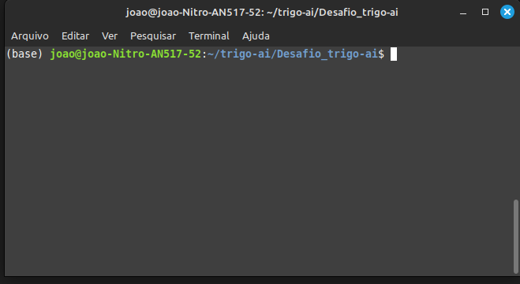
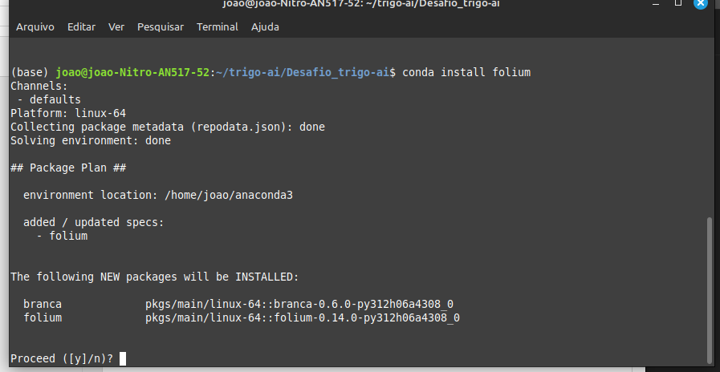
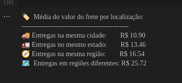
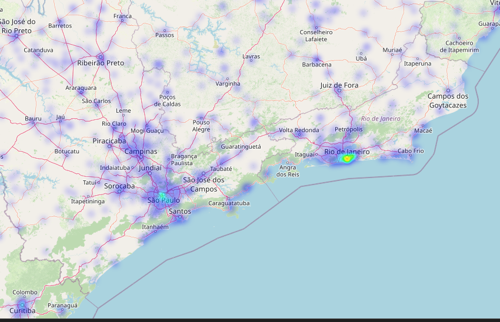
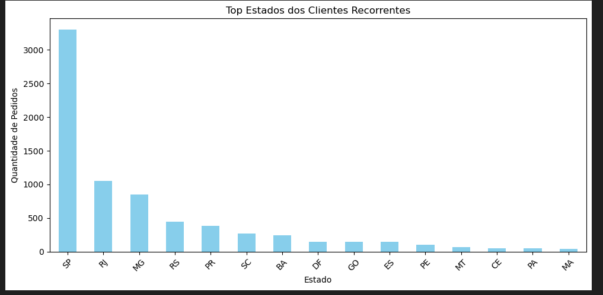

---

# Teste Técnico - Programa Trainee triggo.ai de Excelência em Engenharia de Dados e DataOps 2025

 ---


## 🚀 Como executar o código:

#### Parte 1: Configuração do ambiente

- É recomendada a utilização da plataforma ANACONDA  

- Com o anaconda instalado basta utilizar o ambiente padrão "base" (também chamado de "root") com apenas uma bilioteca a mais chamada "folium" 

- Para adicionar a "folium" no ambiente basta estar com o ambiente ativado na pasta do arquivo, exemplo:



- E digitar:

```conda install folium```

- O resultado deve ser algo do tipo:



- Basta confirmar a instalação

#### Parte 2: Execução do projeto

- Exitem multiplas formas de executar um arquivo ipynb, este projeto em específico foi realizado em sua maioria dentro do VsCode, mas para simples execução do projeto recomento o próprio jupyter notebook do ambiente anaconda.  
- Para isso, assim como nos passo anteriores execute o seguinte comando  com o ambiente ativado na pasta do arquivo

```jupyter notebook```

- O resultado deve ser algo do tipo: 


- Basta selecionar o "projeto.ipynb" e executar.

## 📋 Principais Resultados:

- Todos os comentários e explicações dos resultados estão dentro do notebook para facilitar a leitura e entendimento dos experimentos. Aqui serão apresentadas apenas algumas demosntrações dos resultados principais



